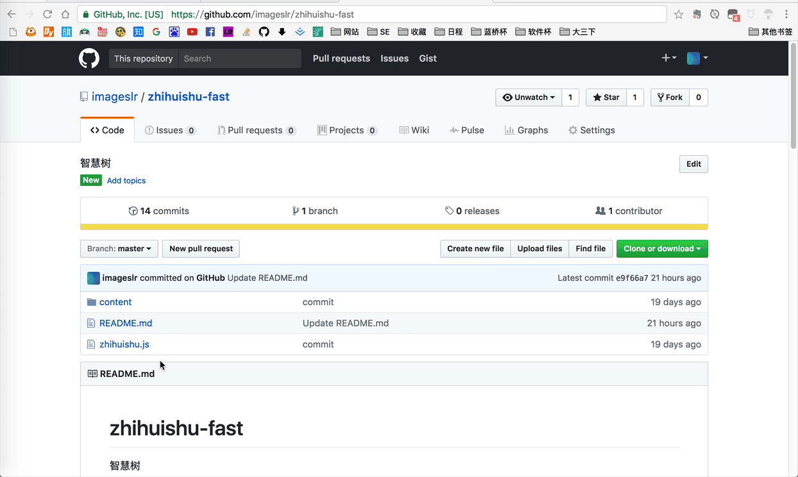

# zhihuishu-fast
智慧树
   
## Usage
* 复制zhuhuishu.js文件中的内容

* 打开智慧树播放视频的页面，在网页上右键 - 检查，打开开发者工具(或在右上方选项中，选择“更多工具” - “开发者工具”；或按下`F12`键)；
  而后进入console，将文件内容粘贴入console，回车执行

* 在console输入`studyTotalTime = 3000;`，回车执行     
 点击每个视频，重复执行此步骤

注： 仅作交流使用，请勿用于其他用途，因个人操作引起的任何问题均与本人无关。

##Notice
* `studyTotalTime = 3000;` 中，3000的意思是3000秒，如果有视频时长大于50分钟，只需将3000改为更大的数即可

* 运行后跳回第一小节不是bug，切换到未看的课程即可

* 运行后console出现的红色报错不是bug，只要执行`studyTotalTime = 3000;`时不出现灰色`undefined`字样即表示程序正确

* 若程序失效，可以给我发issue或者给公众号发送消息

* 欢迎关注我的微信公众号：ImagesLr
